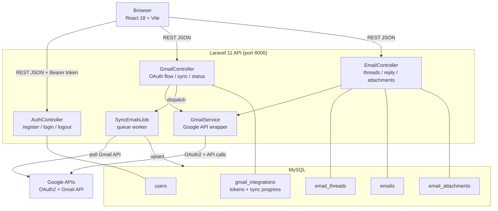
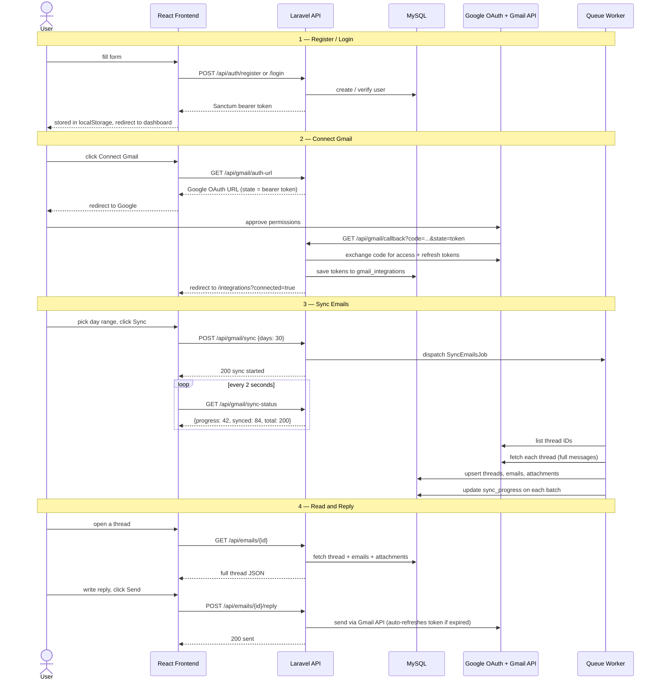

# BeyondChats � Gmail Integration Dashboard

Built for the BeyondChats assignment by **Nithin Rajaseharan**.

Stack: React 18 + Vite � Laravel 11 � MySQL � Google Gmail API � Laravel Sanctum

---

## Video Demo


---

## What I Built

The assignment asked for a Gmail integration dashboard � connect Gmail, sync emails, read threads, reply. I built that, then added a few extras that I thought would make it genuinely useful rather than just a technical demo:

- **Email Analytics** � graphs showing email volume over time and top senders, because a raw email list alone doesn't tell you much
- **Auto-categorization** � labels like Urgent / Promotional / Social / General inferred from subject + sender at sync time
- **Dark mode** � fully implemented, not just a wrapper
- **Star threads** � quick way to flag emails you want to revisit
- **Real-time sync progress bar** � polls the backend every 2 seconds while the queue worker runs, so you can see it actually doing something
- **Search + filter** � filter by category, search by subject/sender across all synced threads

---

## Architecture



**Why queue the sync?**
Email sync hits the Gmail API dozens of times and can take 10-60 seconds depending on volume. Running it synchronously would time out. The API returns "sync started" immediately, a queue worker does the actual work, and the frontend polls `/gmail/sync-status` every 2 seconds to show progress.

---

## Data Flow



---

## Local Setup

### Prerequisites

- PHP 8.2+ with extensions: `pdo_mysql`, `fileinfo`, `zip`, `curl`
- Composer 2.x
- Node.js 18+ and npm
- MySQL 8.0+
- A Google Cloud project with Gmail API enabled

### Google Cloud Setup

1. Go to [console.cloud.google.com](https://console.cloud.google.com)
2. Create a project, enable **Gmail API** under APIs & Services -> Library
3. Create **OAuth 2.0 Client ID** (Web Application type)
4. Add Authorized redirect URI: `http://localhost:8000/api/gmail/callback`
5. Copy the Client ID and Client Secret
6. Under **OAuth consent screen** -> add your Gmail address as a test user (or click Publish App to allow all users)

### Backend

```bash
cd backend

composer install

cp .env.example .env
php artisan key:generate
```

Edit `backend/.env` and fill in:

```env
DB_PASSWORD=yourpassword

GOOGLE_CLIENT_ID=your-client-id
GOOGLE_CLIENT_SECRET=your-client-secret
GOOGLE_REDIRECT_URI=http://localhost:8000/api/gmail/callback
FRONTEND_URL=http://localhost:5173
```

```bash
# Create the database
mysql -u root -p -e "CREATE DATABASE beyondchats;"

# Run migrations
php artisan migrate

# Terminal 1: API server
php artisan serve

# Terminal 2: Queue worker (required for email sync)
php artisan queue:work --queue=email-sync,default
```

> **Windows only:** If you hit `ext-fileinfo` errors with composer, copy your `php.ini`
> to `C:\Users\<you>\php.ini`, uncomment `extension=fileinfo`, `extension=pdo_mysql`,
> `extension=zip`, then run `$env:PHPRC = "$env:USERPROFILE"` before any artisan commands.
>
> If Gmail OAuth fails with a cURL SSL error, download
> [cacert.pem](https://curl.se/ca/cacert.pem), save it locally, and add
> `curl.cainfo=C:\path\to\cacert.pem` to your php.ini.

### Frontend

```bash
cd frontend

npm install

cp .env.example .env
# .env only needs: VITE_API_URL=http://localhost:8000/api

npm run dev
```

Open `http://localhost:5173`, register an account, and connect Gmail.

---

## Project Structure

```
BeyondChat/
+-- backend/
�   +-- app/Http/Controllers/
�   �   +-- AuthController.php       register, login, logout
�   �   +-- GmailController.php      OAuth flow, sync trigger, status, disconnect
�   �   +-- EmailController.php      thread list, thread detail, reply, attachments
�   +-- app/Jobs/
�   �   +-- SyncEmailsJob.php        background worker: fetches + stores emails
�   +-- app/Models/
�   �   +-- GmailIntegration.php     stores OAuth tokens + sync state
�   �   +-- EmailThread.php
�   �   +-- Email.php
�   �   +-- EmailAttachment.php
�   +-- app/Services/
�   �   +-- GmailService.php         wraps Google API client
�   +-- database/migrations/         5 migration files
�   +-- routes/api.php
�
+-- frontend/src/
    +-- pages/
    �   +-- Dashboard.jsx            summary stats + recent threads
    �   +-- Chats.jsx                thread list with search + filter
    �   +-- Integrations.jsx         connect Gmail, start sync
    �   +-- Analytics.jsx            email volume charts, top senders
    +-- components/
    �   +-- EmailThread.jsx          full conversation viewer
    �   +-- ReplyBox.jsx             compose reply inline
    �   +-- SyncModal.jsx            day range picker before sync
    �   +-- Layout.jsx               sidebar nav + dark mode toggle
    +-- contexts/AuthContext.jsx     global auth state
    +-- services/api.js              axios with Authorization header
```

---

## API Reference

| Method | Endpoint | Auth | Notes |
|--------|----------|------|-------|
| POST | `/api/auth/register` | � | |
| POST | `/api/auth/login` | � | Returns Sanctum token |
| POST | `/api/auth/logout` | yes | |
| GET | `/api/auth/me` | yes | |
| GET | `/api/gmail/auth-url` | yes | Returns Google OAuth URL |
| GET | `/api/gmail/callback` | � | Google redirects here after approval |
| GET | `/api/gmail/status` | yes | Connection info + sync state |
| POST | `/api/gmail/sync` | yes | `{ days: 1-90 }` |
| GET | `/api/gmail/sync-status` | yes | Poll for progress % |
| DELETE | `/api/gmail/disconnect` | yes | Removes tokens + all synced data |
| GET | `/api/emails` | yes | Paginated list, filter by category/starred |
| GET | `/api/emails/{id}` | yes | Full thread |
| POST | `/api/emails/{id}/reply` | yes | `{ body, to, cc }` |
| PATCH | `/api/emails/{id}/star` | yes | Toggle star |
| PATCH | `/api/emails/{id}/read` | yes | Mark as read |
| GET | `/api/emails/analytics` | yes | Volume + sender stats |
| GET | `/api/emails/attachment/{id}` | yes | Download file |

